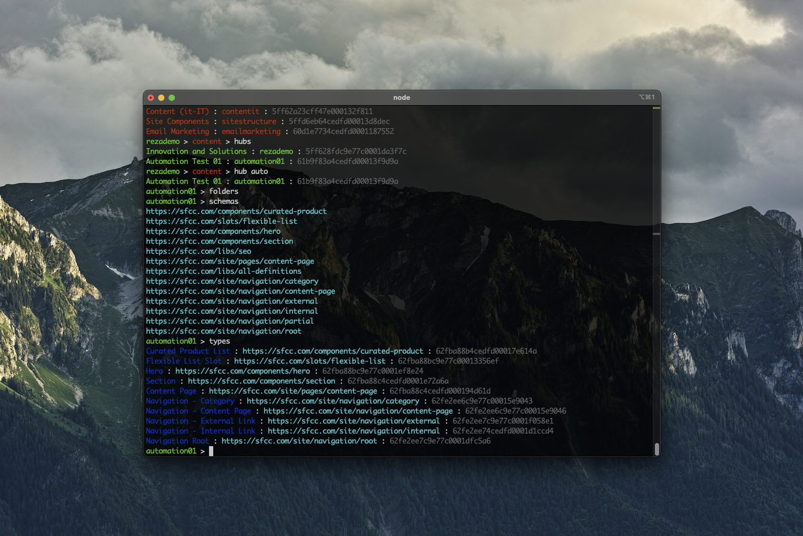

[](https://amplience.com/dynamic-content)

# Amplience Dynamic Content Console



Amplience Dynamic Content Console allows you to navigate your Amplience instance very easily from the command line. 

You can select a hub, repo and go into folders and list content items.

It's also possible to show hub settings, list extensions, webhooks, schemas, types as well.

## Building and starting the console

First you'll need to install the application:

```
npm install
```

You can start the console in development mode (using `ts-node`):

```
npm run start:dev
```

You can build and start the console in production mode (compiled in `./dist` folder):

```
npm run start
```

You can build and clean the application (`./dist` folder):

```
npm run build
npm run clean
```

## Environment setup

### .env file format

Environemnt configuration is done in a local .env file (ignored by git):

```
CLIENT_ID=xxx
CLIENT_SECRET=yyy
HUB_ID=yyy (optional)
REPO_ID=zzz (optional)
FOLDER_ID=aaa (optional)
```

### Working with multiple environments

You can create multiple .env.<environment name> files locally (ignored by git), and switch using the `env <environment name>` command.

## Entering commands

- first token is the command and the rest are the parameters
- tokens with spaces can be surrounded by quotes: `"this is my token"`
- expressions are surrounded with \`\` and can contain spaces: \``2 + 2`\`
- variables are surrounded by double curly braces: `{{myVariable}}`

Example execution:

```
> repos
Content : content : 5ff629064cedfd00013c2600
Slots : slots : 5ff6290bcff47e00014b2bad
Content (fr-FR) : contentfr : 5ff629b052faff00012cd4e4
Content (de-DE) : contentde : 5ff629d8cff47e0001f94cd2
Content (es-ES) : contentes : 5ff629fdc9e77c00016ac81b
Content (it-IT) : contentit : 5ff62a23cff47e000132f811
Site Components : sitestructure : 5ffd6eb64cedfd00013d8dec
Email Marketing : emailmarketing : 60d1e7734cedfd0001187552
8 results
```

## Last single result and array results

- last single result is stored in the `result` variable (for instance one schema, type or item)
- last list of results is stored in the `results` variable as an array (for instance a list of content items)

You can use `result` and `results`:
- in the `eval` command: `eval results.length`
- or in expressions: getting last result id \``result.id`\`, or getting an array of ids `eval results.map(item=>({id: item.id}))`:

```
> eval results.map(item=>({id: item.id}))
[
  { id: '5ff629064cedfd00013c2600' },
  { id: '5ff6290bcff47e00014b2bad' },
  { id: '5ff629b052faff00012cd4e4' },
  { id: '5ff629d8cff47e0001f94cd2' },
  { id: '5ff629fdc9e77c00016ac81b' },
  { id: '5ff62a23cff47e000132f811' },
  { id: '5ffd6eb64cedfd00013d8dec' },
  { id: '60d1e7734cedfd0001187552' }
]
```

## Using variables

Variables are stored in the `context` in `context.variables`. You can use the `setvar` command to set a variable with a value. If you don't specify a value, the variable will be removed.

The `variables` command will show all the variables stored in the context.

Variables using the format `{{myVariable}}` are automatically expanded. For instance in the command `item {{mySavedId}}`.

## Using expressions

Expressions can be used anywhere in the user input. For instance `echo `\``context.variables.mySavedId`\`.

Try \``"ech" + "o"`\` \``results[0].id`\` for fun!

## Supported commands

| Commands | Description |
|----------|-------------|
| `connect, conn clientId clientSecret [hubId]` | connects to an Amplience Dynamic Content instance |
`context` | show current context
`client` | show client details
`env envName` | switch environment, configuration file in `.env.<envName>`, default is in `.env`
`variables` | show all variables
`setvar, var, set varName [varValue]` | set a variable or remove it if no value is specified
`eval` | evaluate a javascript expression, you can access objects like client, context, result, results
`hubs` | list all hubs, save array in results
`hub [hub id, name or label]` | select a hub, save hub in result
`settings` | show hub settings, save settings in result
`schemas` | get all schemas, save array in results
`schema schemaId` | get a schema, save schema in result
`types` | get all content types, save array in results
`type id` | get a content type, save type in result
`repos` | get all repositories, save array in results
`repo [repo id or name]` | select a repository, save repository in result
`folders` | get all folders in the current repo or folder, save array in results
`folder, cd ['' \| folder id \| name \| '..']` | select a folder, reset folder is no parameter or go up to the parent folder using `'..'`, save folder in result
`ls` | do both list folders and list content items in the current repo or folder, only save items in results
`items` | get all content items in the current repo or folder, save arry in results
`item, cat id` | get content item by id, save item in result
`extensions` | get all extensions, save array in results
`extension name` | get extension by name, save extension in result
`webhooks` | get all webhooks, save array in results
`webhook id` | get webhook by id, save webhook in result
`exit, quit, bye` | exit

### Videos

[Amplience Dynamic Content Console - Video 1](media/dc-console-1.mov)

[Amplience Dynamic Content Console - Video 2](media/dc-console-2.mov)
